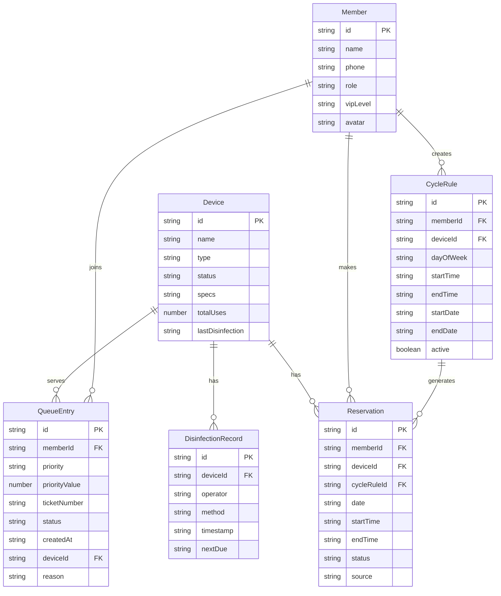

## 1. 架构设计

```mermaid
graph TB
    subgraph "前端层"
        "React App" --> "Router"
        "Router" --> "首页仪表盘"
        "Router" --> "设备排期页"
        "Router" --> "周期预约页"
        "Router" --> "排队叫号页"
    end

    subgraph "状态管理层"
        "首页仪表盘" --> "Zustand Stores"
        "设备排期页" --> "Zustand Stores"
        "周期预约页" --> "Zustand Stores"
        "排队叫号页" --> "Zustand Stores"
        "Zustand Stores" --> "设备Store"
        "Zustand Stores" --> "预约Store"
        "Zustand Stores" --> "排队Store"
        "Zustand Stores" --> "通知Store"
    end

    subgraph "数据层"
        "设备Store" --> "localStorage"
        "预约Store" --> "localStorage"
        "排队Store" --> "localStorage"
        "通知Store" --> "localStorage"
    end
```

## 2. 技术说明

- 前端：React@18 + TypeScript + Tailwind CSS@3 + Vite
- 初始化工具：vite-init
- 状态管理：Zustand（轻量级状态管理，支持持久化中间件）
- 路由：react-router-dom@6
- 后端：无（纯前端，数据存储在 localStorage）
- 图标：lucide-react
- 动画：CSS Animations + Tailwind 动画类

## 3. 路由定义

| 路由 | 用途 |
|------|------|
| `/` | 首页仪表盘，展示今日概览和快速入口 |
| `/devices` | 设备排期页，设备列表、详情、日历、消毒登记 |
| `/devices/:id` | 设备详情，含排期时间轴和消毒记录 |
| `/reservations` | 周期预约页，规则设定、批量预览、预约管理 |
| `/queue` | 排队叫号页，取号、队列、叫号、插队 |

## 4. 数据模型

### 4.1 数据模型定义



### 4.2 数据定义

#### Device（设备）

| 字段 | 类型 | 说明 |
|------|------|------|
| id | string | UUID |
| name | string | 设备名称，如 "VR-01 Quest Pro" |
| type | string | 设备类型：standing/seated/room-scale |
| status | string | 状态：idle/in-use/disinfecting/maintenance |
| specs | string | 设备规格描述 |
| totalUses | number | 累计使用次数 |
| lastDisinfection | string | 上次消毒时间 ISO |

#### DisinfectionRecord（消毒记录）

| 字段 | 类型 | 说明 |
|------|------|------|
| id | string | UUID |
| deviceId | string | 关联设备ID |
| operator | string | 操作人 |
| method | string | 消毒方式：UV/wipe/spray |
| timestamp | string | 消毒时间 ISO |
| nextDue | string | 下次应消毒时间 ISO |

#### CycleRule（周期规则）

| 字段 | 类型 | 说明 |
|------|------|------|
| id | string | UUID |
| memberId | string | 关联会员ID |
| deviceId | string | 关联设备ID |
| dayOfWeek | string | 周几：1-7 |
| startTime | string | 开始时间 HH:mm |
| endTime | string | 结束时间 HH:mm |
| startDate | string | 规则起始日期 YYYY-MM-DD |
| endDate | string | 规则结束日期 YYYY-MM-DD |
| active | boolean | 规则是否启用 |

#### Reservation（预约）

| 字段 | 类型 | 说明 |
|------|------|------|
| id | string | UUID |
| memberId | string | 关联会员ID |
| deviceId | string | 关联设备ID |
| cycleRuleId | string | 来源周期规则ID，手动预约为null |
| date | string | 预约日期 YYYY-MM-DD |
| startTime | string | 开始时间 HH:mm |
| endTime | string | 结束时间 HH:mm |
| status | string | 状态：confirmed/cancelled/completed/conflict |
| source | string | 来源：cycle/manual |

#### QueueEntry（排队记录）

| 字段 | 类型 | 说明 |
|------|------|------|
| id | string | UUID |
| memberId | string | 关联会员ID |
| priority | string | 优先级：normal/vip/emergency |
| priorityValue | number | 排序权重：emergency=100, vip=50, normal=0 |
| ticketNumber | string | 叫号码，如 A001 |
| status | string | 状态：waiting/serving/skipped/completed |
| createdAt | string | 取号时间 ISO |
| deviceId | string | 期望设备ID（可选） |
| reason | string | 插队原因（VIP/应急时填写） |

#### Member（会员）

| 字段 | 类型 | 说明 |
|------|------|------|
| id | string | UUID |
| name | string | 会员姓名 |
| phone | string | 手机号 |
| role | string | 角色：member/vip/admin |
| vipLevel | string | VIP等级：none/silver/gold/platinum |
| avatar | string | 头像URL |

## 5. 优先级队列算法

队列采用加权优先级排序，非纯先到先得：

1. **应急通道**（priorityValue=100）：设备故障应急、特殊活动，可插队至队首
2. **VIP会员**（priorityValue=50）：金卡/白金卡会员，优先于普通会员
3. **普通会员**（priorityValue=0）：按取号时间先后排序

排序规则：先按 priorityValue 降序，同优先级按 createdAt 升序。

插队操作：
- VIP插队：插入到所有普通会员之前，排在已有VIP之后
- 应急插队：直接插入队首
- 插队需填写原因，记录操作日志

## 6. 周期生成算法

1. 会员设定周期规则（设备 + 每周某天 + 固定时段 + 起止日期）
2. 系统按规则遍历起止日期内的所有目标周几
3. 对每个目标日期生成 Reservation 记录
4. 生成前检测冲突：同一设备同一时段是否已有预约
5. 冲突项标记为 conflict 状态，提示会员手动处理
6. 无冲突项直接标记为 confirmed
7. 生成后会员可单独调整某条预约的时段或设备
